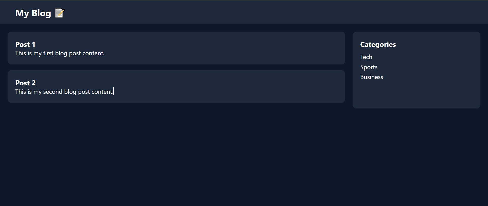

# 📝 Advanced Blog Website - Day 1 Project 17

## 📌 Project Overview

This project is a modern **Blog Website with Sidebar** created as part of my semester challenge to build 200 websites.

It represents a professional blog layout with posts on the main section and a sidebar for categories.

---

## 🎯 Features

* 📝 Blog Post Section
* 📂 Sidebar with Categories
* 🌐 Navigation Bar
* 📱 Responsive Layout
* 🎨 Clean and Professional UI

---

## 🛠️ Technologies Used

* HTML5
* CSS3 (Flexbox)

---

## 📂 Project Structure

```id="h8v2x1"
site-17-blog-advanced/
│
├── index.html
├── style.css
├── preview.png
└── README.md
```

---

## 📸 Preview




---

## 💡 Learning Outcome

* Learned multi-column layout design
* Practiced Flexbox for layout structure
* Built blog + sidebar UI
* Improved UI/UX design skills
* Strengthened Git & GitHub workflow

---

## 🔥 Author

**Yash Patil**
Future Data Engineer 🚀

---

## ⭐ Note

This project is part of my goal to build **200 websites** to improve my web development and design skills.
